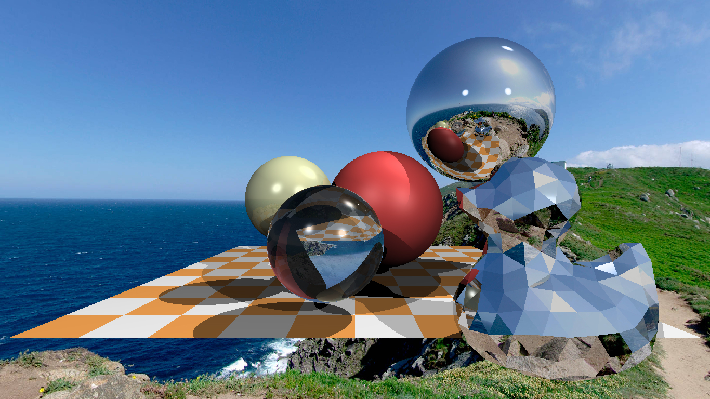

# TinyRayTracer
A Demo of Ray Tracer, refer:https://github.com/ssloy/tinyraytracer/wiki/Part-1:-understandable-raytracing

the result is:

## Effective test

bvh: 256 * 256 took 21 seconds 512 * 512 took 87 seconds 1366 * 768 took 243 seconds

origial: 256 * 256 took 43 seconds 512 * 512 took 180 seconds 1366 * 768 took 443 seconds